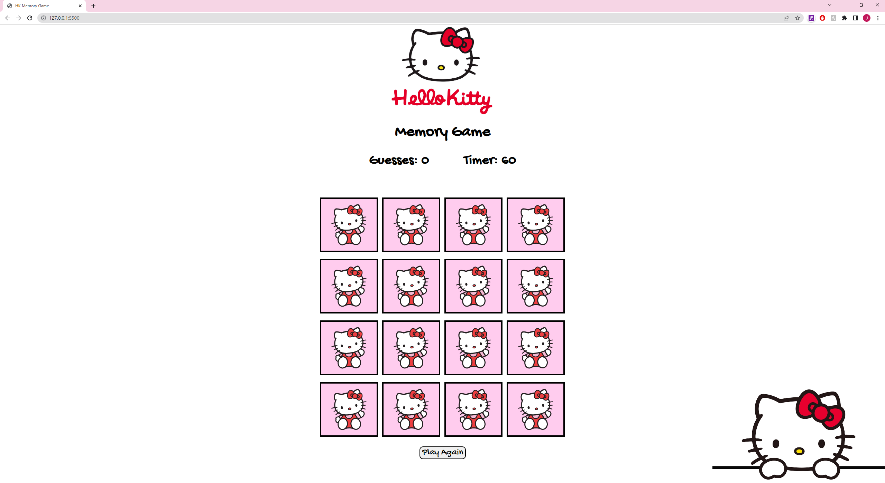
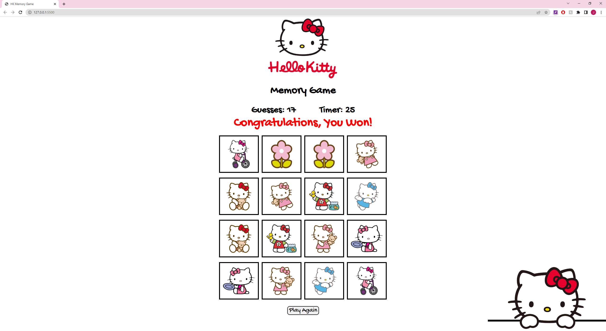
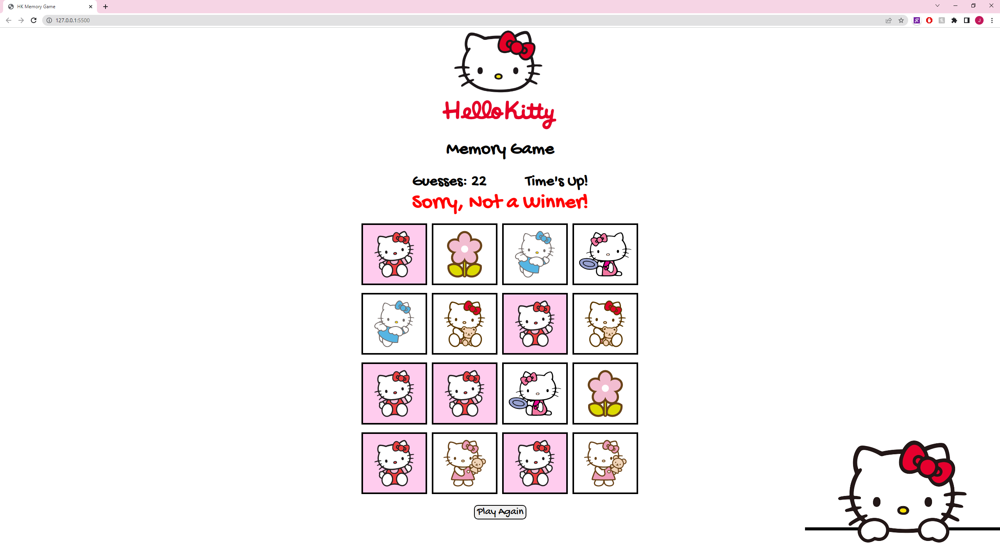

# JF-Memory-Game
 Title: Hello Kitty Memory Game

# Background of the Game
The Hello Kitty Memory Game is a matching game which consists of 8 pairs of Hello Kitty pictures. The goal of this game is to match all cards within the time period. When the player first clicks the card, a timer will start to count down from one minute. If the player matches all cards, the player wins. If the player runs out of time, the game stops and is unable to continue. The game also consists of a score keeper, which tallies the amount of attempts the player has tried to match each pair of cards. There is a reset button which shuffles the cards, and the timer resets to 60 seconds.

# Screenshots 
 

 

 

# Languages and Tool Used:
* HTML5
* JavaScript
* CSS
* Google Fonts
* Shuffle function from Joseph Perez [Ref Link](https://p14.medium.com/shuffle-an-array-javascript-cbc6fa8662a0)

# Getting Started: 
To access game: [HK-Memory-Game](https://jennyyhfang.github.io/JF-Memory-Game/)

# Important Instruction:
Try to remember all positions of the cards and match all pairs of cards before the timer runs out. 

# Next Steps: 
In the future I plan to...
* Add music
* New Picture Rotation
* Flipping Card Animation 

